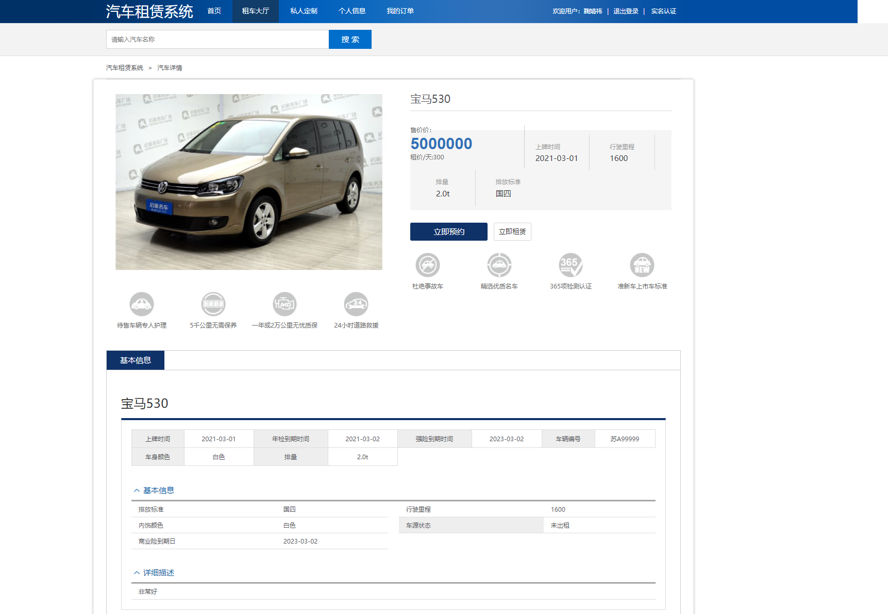
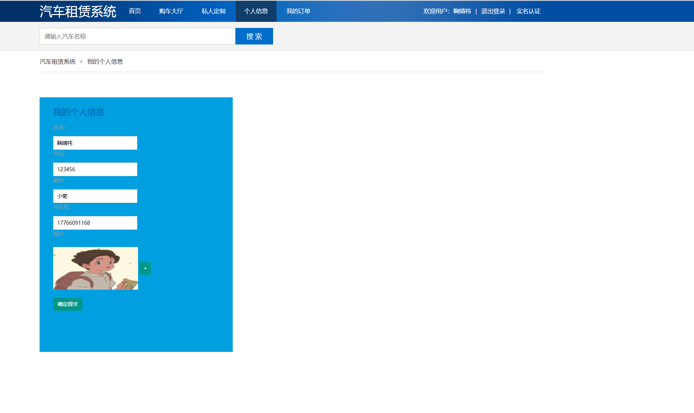
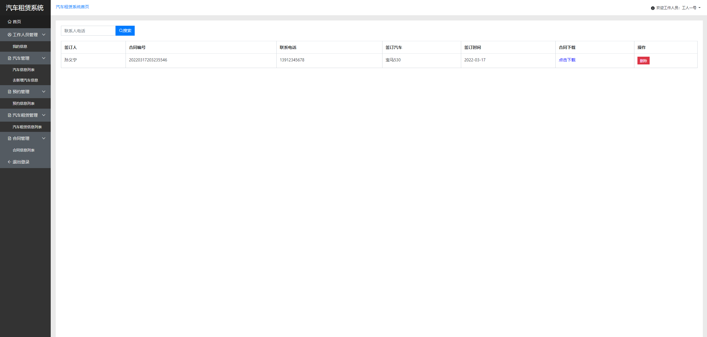
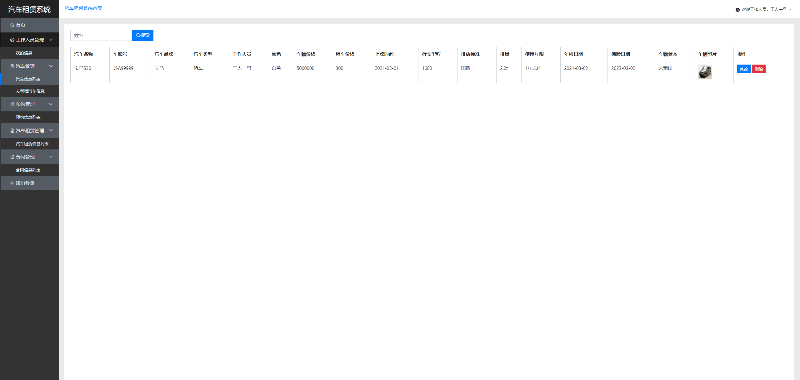
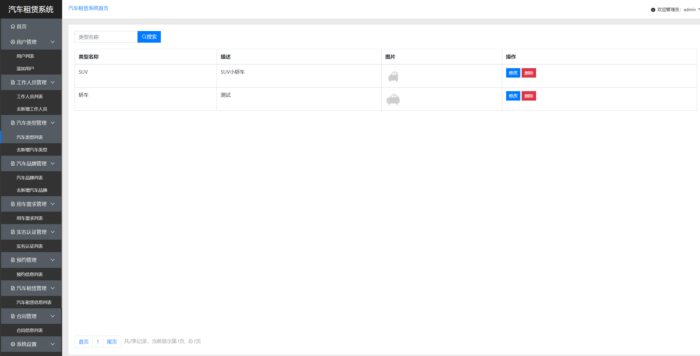
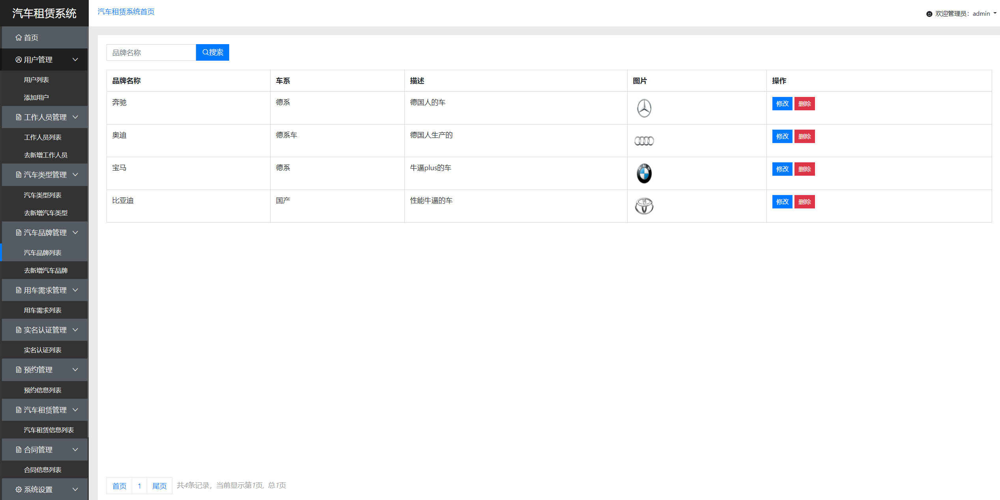
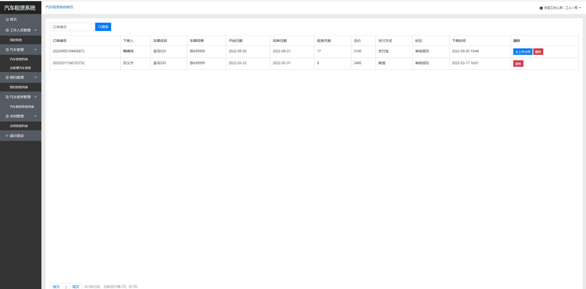
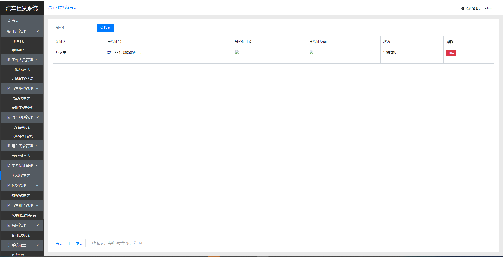
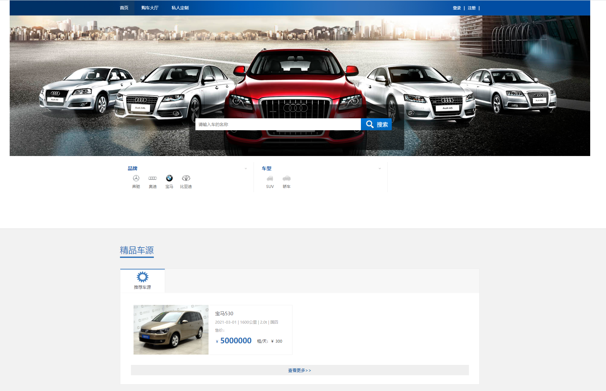

## 基于SSM框架的汽车租赁系统

- <b>完整代码获取地址：从戎源码网 ([https://armycodes.com/](https://armycodes.com/))</b>
- <b>技术探讨、资料分享，请加QQ群：692619798</b> 
- <b>作者微信：19941326836  QQ：952045282</b> 
- <b>承接计算机毕业设计、Java毕业设计、Python毕业设计、深度学习、机器学习</b>
- <b>选题+开题报告+任务书+程序定制+安装调试+论文+答辩ppt 一条龙服务</b>
- <b>所有选题地址 ([https://github.com/YuLin-Coder/AllProjectCatalog](https://github.com/YuLin-Coder/AllProjectCatalog)) </b>

## 项目介绍
基于SSM框架的汽车租赁系统，系统分为用户、工作人员、管理员三个角色，主要功能如下

【工作人员】
工作人员管理：我的信息
汽车管理：汽车信息列表、新增汽车信息
预约管理：预约信息列表
汽车租赁管理：汽车租赁管理列表
合同管理：合同管理信息列表

【管理员】
登录、用户管理、工作人员管理、汽车类型管理、汽车品牌管理、用户需求管理、实名认证管理、预约管理、汽车租赁管理、预约管理、数据统计、系统设计

## 项目技术
- 编程语言：Java
- 数据库：MySQL
- 前端技术：JSP、JavaScript、Jquery、echarts
- 后端技术：Spring、SpringMVC、MyBatis

## 运行环境
- JDK版本：JDK1.8及以上
- 开发工具：IDEA、Ecplise、Myecplise都可以
- 数据库: MySQL5.7及以上

## 运行截图

